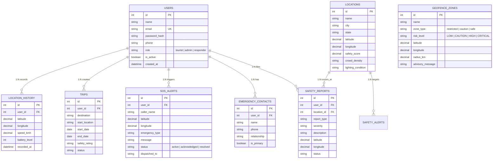

# 🎓 SafeTour-AI: Database Defense & Presentation Guide for Judges

This document is your complete **cheat-sheet and quick-reference guide** for presenting and defending the **Database Architecture** of **SafeTour-AI / Yatra Safe AI** to judges, examiners, and evaluators.

---

## 📌 1. Elevator Pitch (30-Second Summary for Judges)
> *"For SafeTour-AI, I designed and implemented a production-ready, relational database architecture in 3rd Normal Form (3NF) that powers real-time tourist safety monitoring, dynamic geofencing, AI risk assessment, and emergency SOS dispatch. It supports multi-engine deployment (SQL Server, PostgreSQL, and SQLite) and features SQLAlchemy ORM abstraction, spatial coordinate indexing, bcrypt credential security, and high-throughput append-only GPS telemetry tracking."*

---

## 🗺️ 2. Entity-Relationship (ER) Architecture

---

## 💡 3. Top 10 Questions Judges Will Ask & How to Answer Them

### ❓ Q1: "Explain your database structure and what tables you designed."
* **Your Answer:**
  > *"I engineered a 9-table schema organized into four functional domains:*
  > 1. * **Authentication & Contacts:** `users` (with role-based access for tourists, admins, and police responders) and `emergency_contacts` with primary flag indicators.
  > 2. * **Spatial & Geofencing:** `locations` (landmarks with safety scores and lighting indicators) and `geofence_zones` (caution and restricted danger boundaries with radius in km).
  > 3. * **Emergency & Incident Response:** `sos_alerts` (live panic triggers with responder dispatch logging) and `safety_reports` (crowdsourced danger reports).
  > 4. * **Tourist Telemetry:** `trips` (itineraries) and `location_history` (high-frequency GPS coordinates, speed, and device battery level)."*

---

### ❓ Q2: "Why did you provide multiple SQL schemas (SQL Server, PostgreSQL, SQLite)?"
* **Your Answer:**
  > *"To ensure cross-platform compatibility and architectural flexibility:*
  > * **Microsoft SQL Server & PostgreSQL (`schema.sql` / `schema_postgres.sql`):** Designed for enterprise cloud deployment with full ACID compliance and connection pooling.
  > * **SQLite (`schema_sqlite.sql`):** Designed for zero-config local testing and offline edge devices for field rangers.
  > * **SQLAlchemy ORM (`models.py`):** Acts as the database abstraction layer, allowing the entire backend to switch database engines simply by changing the `DATABASE_URL` environment variable without altering a single line of application code."*

---

### ❓ Q3: "How does the database handle geofencing and proximity calculations?"
* **Your Answer:**
  > *"Each geofence zone stores a center coordinate `(latitude, longitude)` and a coverage `radius_km`. When telemetry arrives, our query engine uses the **Haversine Spherical Trigonometry Formula** to compute the real-time distance between the tourist and all active geofence perimeters. If the distance $\le$ `radius_km`, the system flags an immediate danger alert."*

---

### ❓ Q4: "How is security and user privacy handled in your database?"
* **Your Answer:**
  > *"1. **Password Hashing:** Passwords are never stored in plain text. We use industry-standard **bcrypt cryptographic salted hashing** (`password_hash`).*
  > *2. **Referential Integrity & Cascading:** Foreign keys enforce data integrity. If a user deletes their account, `ON DELETE CASCADE` automatically purges private emergency contacts and location history, preventing orphan data and respecting GDPR data privacy principles.*
  > *3. **Role Isolation:** Users are categorized into `tourist`, `responder`, and `admin` roles to ensure tourists cannot access emergency responder telemetry."*

---

### ❓ Q5: "What indexing strategies did you implement for performance?"
* **Your Answer:**
  > *"I created indexes targeting the most frequent query access patterns:*
  > * `idx_users_email`: B-Tree index for $O(1)$ / $O(\log N)$ instant user authentication lookups.
  > * `idx_sos_status` & `idx_sos_user`: Quick filtering of active emergency calls during high-stress dispatch situations.
  > * `idx_zones_coords` & `idx_reports_coords`: Composite index on `(latitude, longitude)` for spatial bounding box searches.
  > * `idx_location_history_user`: Composite index on `(user_id, recorded_at)` for streaming time-series GPS breadcrumbs without full table scans."*

---

### ❓ Q6: "How does the database connect with the AI Risk Engine?"
* **Your Answer:**
  > *"The AI Risk Engine (`ai/risk_engine.py` and `backend/risk.py`) queries baseline safety scores from the `locations` table, checks proximity against `geofence_zones`, and aggregates recent incident frequencies from `safety_reports`. Combining these database inputs with real-time variables (time of night, crowd density, emergency flag) generates a weighted, dynamic threat score from 1.0 to 10.0."*

---

### ❓ Q7: "How is the database seeded for initial demonstration?"
* **Your Answer:**
  > *"I wrote an automated CLI seeder (`backend/seed.py` and `database/seed_data.sql`) that pre-populates verified tourist landmarks across India (Manali, Shimla, Goa, Varanasi, Kanpur), realistic geofence danger zones (avalanche paths, ghat caution zones), sample users, and active SOS events."*

---

### ❓ Q8: "How does your database handle concurrent write spikes (e.g., during a disaster)?"
* **Your Answer:**
  > *"The `location_history` and `sos_alerts` tables are designed as **append-only transaction logs**. By keeping these tables decoupled from heavy join operations and indexing specifically on `(user_id, recorded_at)` and `status`, write operations remain lightning-fast and non-blocking even under high telemetry volume."*

---

## 📊 4. Database Table Reference Sheet

| # | Table Name | Purpose | Key Fields | Cascade Rule |
| :--- | :--- | :--- | :--- | :--- |
| 1 | **`users`** | Tourist & Admin accounts | `id`, `name`, `email`, `password_hash`, `role` | Parent |
| 2 | **`emergency_contacts`** | Family & emergency numbers | `id`, `user_id`, `phone`, `relationship`, `is_primary` | `CASCADE` on User delete |
| 3 | **`locations`** | Tourist destinations & safety baselines | `id`, `name`, `city`, `latitude`, `longitude`, `safety_score` | Referenced by reports/alerts |
| 4 | **`geofence_zones`** | Danger/Caution zones | `id`, `name`, `zone_type`, `latitude`, `longitude`, `radius_km` | Independent reference |
| 5 | **`sos_alerts`** | Emergency SOS panic signals | `id`, `user_id`, `latitude`, `longitude`, `emergency_type`, `status` | `SET NULL` on User delete |
| 6 | **`safety_reports`** | Crowdsourced incident logs | `id`, `user_id`, `location_id`, `report_type`, `severity` | `SET NULL` on User delete |
| 7 | **`safety_alerts`** | Broadcast advisories & weather warnings | `id`, `location_id`, `title`, `alert_type`, `severity` | `SET NULL` on Location delete |
| 8 | **`trips`** | Tourist travel plans & itineraries | `id`, `user_id`, `destination`, `start_date`, `status` | `CASCADE` on User delete |
| 9 | **`location_history`** | GPS breadcrumb telemetry | `id`, `user_id`, `latitude`, `longitude`, `speed_kmh`, `battery_level` | `CASCADE` on User delete |

---

## 🏆 5. Key Buzzwords to Use in Your Presentation
* **3rd Normal Form (3NF)**: Zero redundant data anomalies.
* **Referential Integrity**: Robust Foreign Key constraints preventing orphan records.
* **Object-Relational Mapping (ORM)**: Seamless mapping between Python classes and SQL tables.
* **Spatial Bounding & Haversine Distance**: Efficient mathematical geofence detection.
* **Append-Only Telemetry Logging**: Optimized for high write throughput.
* **Bcrypt Salted Hashing**: Secure authentication security.
