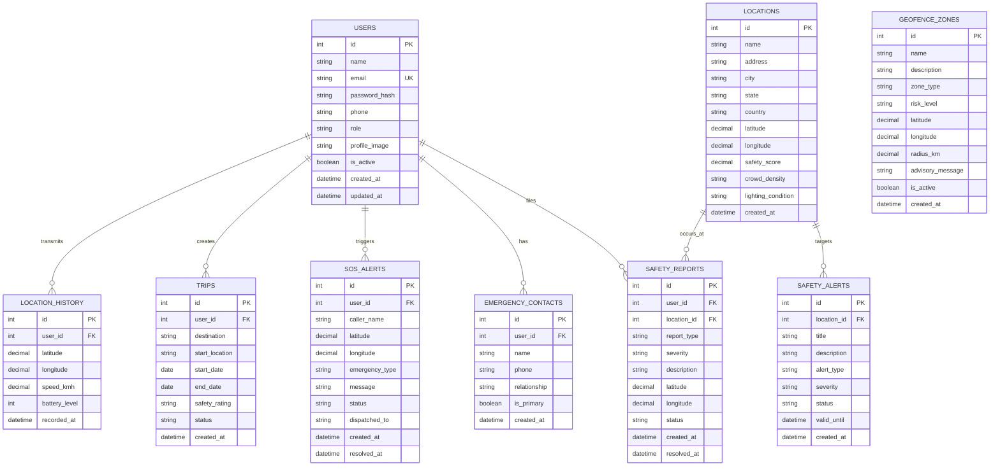

# SafeTour-AI Database Architecture Documentation

## 📌 Overview
The SafeTour-AI database is designed for high-availability tourist safety telemetry, AI-driven risk assessment, geofence danger tracking, emergency SOS dispatching, and crowd monitoring.

Supports:
- **Microsoft SQL Server** (`schema.sql`)
- **PostgreSQL** (`schema_postgres.sql`)
- **SQLite** (`schema_sqlite.sql`)
- **SQLAlchemy ORM** (`backend/models.py`)

---

## 🗺️ Entity-Relationship (ER) Diagram



---

## 📊 Database Schema Details

| Table | Description | Key Indexes |
| :--- | :--- | :--- |
| `users` | Tourist profiles, auth credentials & roles | `idx_users_email` |
| `emergency_contacts` | Trusted emergency phone numbers & relations | `user_id` FK |
| `locations` | Tourist spots, safety scores & crowd telemetry | `latitude`, `longitude` |
| `geofence_zones` | Hazard & restricted safety perimeters | `idx_zones_coords` |
| `safety_reports` | Crowdsourced incident logs & danger flags | `idx_reports_user`, `idx_reports_coords` |
| `sos_alerts` | Live emergency triggers & dispatch logs | `idx_sos_user`, `idx_sos_status` |
| `safety_alerts` | Public safety advisories & warnings | `location_id` FK |
| `trips` | Itineraries & trip safety ratings | `idx_trips_user` |
| `location_history` | Continuous GPS breadcrumb trails | `idx_location_history_user` |

---

## 🚀 How to Initialize & Seed the Database

### Method 1: Using Python CLI (Recommended)
```bash
# Run from SafeTour-AI root
python backend/seed.py
```
This automatically initializes the SQLite database (`safetour_ai.db`) and seeds standard Indian tourist destinations, hazard zones, and test users.

### Method 2: SQL Scripts
* **Microsoft SQL Server**: Run `database/schema.sql` followed by `database/seed_data.sql`.
* **PostgreSQL**: Execute `psql -d safetour_ai -f database/schema_postgres.sql` and `database/seed_data.sql`.
* **SQLite**: `sqlite3 safetour_ai.db < database/schema_sqlite.sql && sqlite3 safetour_ai.db < database/seed_data.sql`.
